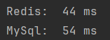
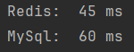
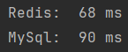
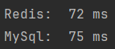

## Модуль 4. Финальный проект. "Hibernate".

------

### Запуск проекта:

#### 1. Запустить MySQL сервер как докер-контейнер
Выполнить команду: 
- `docker run --name mysql -d -p 3306:3306 -e MYSQL_ROOT_PASSWORD=root --restart unless-stopped -v mysql:/var/lib/mysql mysql:8`

Рассмотрим, что мы делаем этой командой:
- `docker run` – запуск (и скачивание, если он еще не скачан на локальную машину) имиджа. В результате запуска получим запущенный контейнер.
- `--name mysql` – задаем имя контейнера mysql.
- `-d` – флаг, который говорит, что контейнер должен продолжать работать, даже если закрыть окно терминала, откуда этот контейнер запускался.
- `-p 3306:3306` – указывает порты. До двоеточия – порт на локальной машине, после двоеточия – порт в контейнере.
- `-e MYSQL_ROOT_PASSWORD=root` – передача переменной окружения MYSQL_ROOT_PASSWORD со значением root в контейнер. Флаг специфичный именно для образа mysql/
- `--restart unless-stopped` – установка политики поведения (должен ли контейнер перезапускаться при закрытии). Значение unless-stopped значит перезапускать всегда, кроме случая, когда контейнер был остановлен /
- `-v mysql:/var/lib/mysql` – добавить volume (образ для хранения информации).
- `mysql:8` – название имиджа и его версия.

---
#### 3. Развернуть дамп
- Дамп находится в корне проекта (дамп является копией со страницы финального задания модуля на сайте javarush.com)

---
#### 3. Запустить Redis сервер как докер-контейнер

Выполнить команду:
- `docker run -d --name redis-stack -p 6379:6379 -p 8001:8001 redis/redis-stack:latest`

#### 3. Запустить через класс Main.

---
### Тесты
#### 1. Пустой Redis, Только что запущеный MySql

#### 2. Второй запуск: В Redis есть данные

#### 3. Ноутбук отключен от сети (экономия энергии)

#### 4. Оперативная память нагружена на 90%

